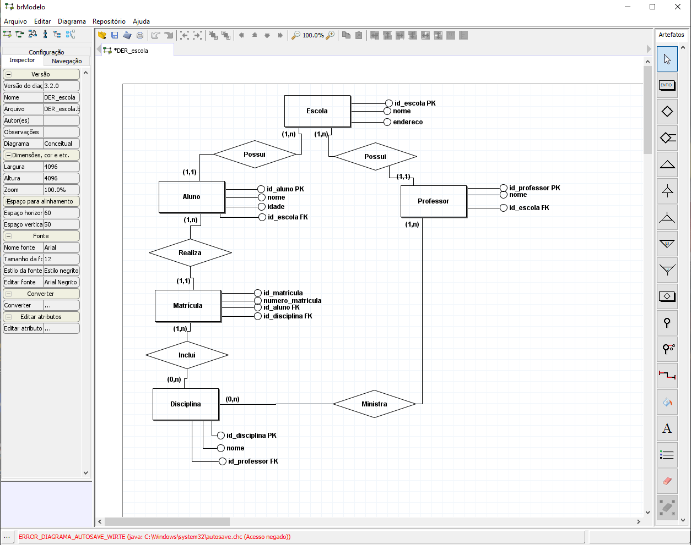

# 🏫 Banco de Dados Escolar

Projeto acadêmico de modelagem e implementação de um banco de dados para uma instituição de ensino.

O projeto tem como objetivo aplicar conceitos de **modelagem de dados, modelo relacional e SQL**, organizando informações de escolas, alunos, professores, disciplinas e matrículas.

## 📌 Objetivo

Desenvolver uma estrutura de banco de dados capaz de armazenar e relacionar as principais informações de uma instituição de ensino, mantendo os dados organizados e os relacionamentos entre as entidades.

## 🗂️ Estrutura do Banco

O banco de dados é composto pelas seguintes tabelas:

### Escola

Armazena as informações básicas da instituição de ensino.

* `id_escola` — Chave primária
* `nome`
* `endereco`

### Aluno

Armazena os dados dos alunos e sua vinculação com a escola.

* `id_aluno` — Chave primária
* `nome`
* `idade`
* `id_escola` — Chave estrangeira

### Professor

Armazena os dados dos professores e sua vinculação com a escola.

* `id_professor` — Chave primária
* `nome`
* `id_escola` — Chave estrangeira

### Disciplina

Armazena as disciplinas e o professor responsável.

* `id_disciplina` — Chave primária
* `nome`
* `id_professor` — Chave estrangeira

### Matrícula

Relaciona os alunos às disciplinas nas quais estão matriculados.

* `id_matricula` — Chave primária
* `numero_matricula`
* `id_aluno` — Chave estrangeira
* `id_disciplina` — Chave estrangeira

## 🔗 Relacionamentos

```text
Escola
 ├── 1:N → Aluno
 └── 1:N → Professor

Professor
 └── 1:N → Disciplina

Aluno
 └── 1:N → Matrícula

Disciplina
 └── 1:N → Matrícula
```

A tabela **Matrícula** funciona como uma entidade associativa entre **Aluno** e **Disciplina**, permitindo registrar quais disciplinas estão vinculadas a cada aluno.

## 🛠️ Tecnologias

* **MySQL** — Sistema de gerenciamento do banco de dados
* **SQL** — Linguagem utilizada para criação e manipulação dos dados
* **MySQL Workbench** — Ferramenta utilizada para execução e testes
* **brModelo** — Utilizado para elaboração do Diagrama Entidade-Relacionamento
* **Visual Studio Code** — Utilizado para edição do código SQL

## 📁 Estrutura do Projeto

```text
BancoDeDadosEscolar/
│
├── banco_escola.sql
├── README.md
└── DER/
    └── diagrama.png
```

> A pasta `DER` pode ser adicionada caso o diagrama seja incluído no repositório.

## 🚀 Como executar

### 1. Pré-requisitos

É necessário ter instalado:

* MySQL Server
* MySQL Workbench ou outra ferramenta compatível com MySQL

### 2. Clonar o repositório

```bash
[git clone URL_DO_REPOSITORIO](https://github.com/SamuelLidio/ProjetosFaculdade.git)
```

### 3. Executar o script

Abra o arquivo:

```text
banco_escola.sql
```

no MySQL Workbench e execute o script.

O arquivo contém:

1. Criação do banco de dados;
2. Criação das tabelas;
3. Definição das chaves primárias e estrangeiras;
4. Inserção de dados de exemplo;
5. Consultas para teste.

## 🧪 Testes

Após executar o script, é possível verificar as tabelas utilizando:

```sql
USE escola;

SHOW TABLES;
```

Também podem ser consultados os dados:

```sql
SELECT * FROM Escola;
SELECT * FROM Aluno;
SELECT * FROM Professor;
SELECT * FROM Disciplina;
SELECT * FROM Matricula;
```

Para verificar os relacionamentos:

```sql
SELECT 
    Aluno.nome AS aluno,
    Disciplina.nome AS disciplina,
    Professor.nome AS professor,
    Matricula.numero_matricula
FROM Matricula
JOIN Aluno 
    ON Matricula.id_aluno = Aluno.id_aluno
JOIN Disciplina 
    ON Matricula.id_disciplina = Disciplina.id_disciplina
JOIN Professor 
    ON Disciplina.id_professor = Professor.id_professor;
```

## 📊 Modelo Entidade-Relacionamento

O projeto possui um Diagrama Entidade-Relacionamento representando as entidades, atributos, relacionamentos e cardinalidades utilizadas na construção do banco.

**DER:**



## 🎓 Contexto Acadêmico

Projeto desenvolvido para fins acadêmicos, com o objetivo de praticar conceitos de:

* Modelagem de banco de dados;
* Diagrama Entidade-Relacionamento;
* Modelo relacional;
* Chaves primárias e estrangeiras;
* Relacionamentos entre entidades;
* Comandos SQL;
* Criação e manipulação de tabelas.

## 👨‍💻 Autor

**Samuel Luiz Lidio**

Projeto desenvolvido como atividade acadêmica de banco de dados.
